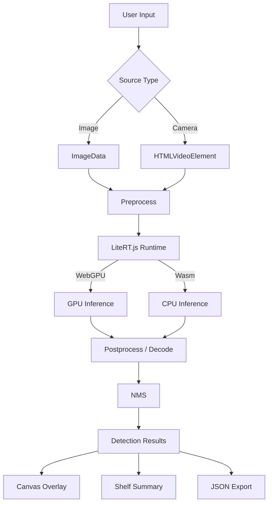
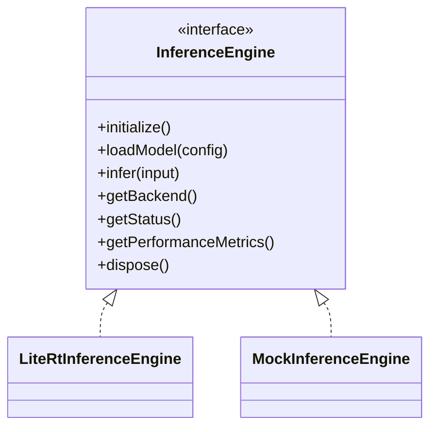

# Architecture

## Overview

LiteRT.js Shelf Inspector is a static web application that runs object detection entirely in the browser. It uses LiteRT.js to load and execute TFLite models via WebGPU (with a Wasm/CPU fallback).



## Module structure

| Module | Responsibility |
|--------|---------------|
| `inference/types.ts` | All shared TypeScript interfaces |
| `inference/model-config.ts` | Model configuration and validation |
| `inference/litert-adapter.ts` | LiteRT.js engine implementation |
| `inference/mock-adapter.ts` | Mock engine for dev/testing |
| `inference/engine-factory.ts` | Engine selection and instantiation |
| `inference/preprocess.ts` | Image preprocessing, letterboxing, normalization |
| `inference/postprocess/` | SSD/YOLO decoders, NMS |
| `hooks/` | React hooks for inference and camera |
| `features/capture/` | Image upload, camera, sample loader |
| `features/detection/` | Canvas overlay, confidence controls |
| `features/reporting/` | Shelf summary, JSON export |
| `features/performance/` | Timing and metrics display |
| `utils/` | Pure functions (coordinates, analysis, report) |

## Inference engine abstraction

The `InferenceEngine` interface decouples components from LiteRT.js:



A factory function selects the implementation based on model file availability.

## WebGPU fallback strategy

1. Attempt WebGPU compilation
2. If WebGPU fails, attempt Wasm/CPU compilation
3. If both fail, show error with troubleshooting guidance
4. No infinite retry loops

## Web Worker consideration

NMS and post-processing are pure JavaScript computations that could run in a Web Worker. The current implementation keeps them on the main thread because:

- The computations are fast (<5ms for typical detection counts)
- LiteRT.js and WebGPU contexts cannot be shared across workers
- Worker overhead (message serialization) would exceed the computation time for small result sets

For models producing many raw detections (>1000), moving NMS to a worker would be beneficial. This is noted as a future optimization.

## Camera inference loop

The camera inference loop uses a sequential pattern to prevent overlapping calls:

```
requestAnimationFrame → infer() → await result → requestAnimationFrame → ...
```

Each frame waits for the previous inference to complete before scheduling the next.
